# WiseCare Technical Design Document

**Version:** 1.0  
**Date:** February 2026  
**Document Type:** Technical Architecture Specification  

---

## Executive Summary

This document outlines the comprehensive technical architecture for WiseCare, an AI-driven eldercare platform designed for the Indian market. The system leverages cloud-native technologies, IoT integration, and advanced AI agents to provide seamless care coordination between elderly users and their families abroad.

## Table of Contents

1. [System Architecture](#1-system-architecture)
2. [Database Design](#2-database-design)
3. [API Specification](#3-api-specification)
4. [User Interface Guidelines](#4-user-interface-guidelines)
5. [Technology Stack](#5-technology-stack)
6. [Security & Compliance](#6-security--compliance)
7. [Deployment Strategy](#7-deployment-strategy)

---

## 1. System Architecture

### 1.1 Architecture Overview

WiseCare implements a cloud-native, microservices architecture on AWS, optimized for real-time health monitoring and AI-driven care automation. The system ensures 99.9% uptime with sub-2-second emergency response times.

### 1.2 System Architecture Diagram

```mermaid
graph TB
    %% Styling
    classDef iotLayer fill:#E3F2FD,stroke:#1976D2,stroke-width:2px
    classDef gatewayLayer fill:#F3E5F5,stroke:#7B1FA2,stroke-width:2px
    classDef processingLayer fill:#E8F5E8,stroke:#388E3C,stroke-width:2px
    classDef storageLayer fill:#FFF3E0,stroke:#F57C00,stroke-width:2px
    classDef appLayer fill:#FFEBEE,stroke:#D32F2F,stroke-width:2px
    classDef externalLayer fill:#F5F5F5,stroke:#616161,stroke-width:2px

    %% IoT Layer
    subgraph "IoT Device Layer"
        W[📱 Wearable Devices<br/>Heart Rate • Blood Pressure<br/>Activity Monitoring]:::iotLayer
        C[📹 Smart Cameras<br/>Fall Detection<br/>Activity Recognition]:::iotLayer
        S[🏠 Environmental Sensors<br/>Motion • Door • Temperature]:::iotLayer
    end
    
    %% Gateway Layer
    subgraph "API Gateway Layer"
        IG[🌐 AWS IoT Core<br/>MQTT/HTTPS Ingestion<br/>Device Management]:::gatewayLayer
        ALB[⚖️ Application Load Balancer<br/>SSL Termination<br/>Health Checks]:::gatewayLayer
        AG[🔐 API Gateway<br/>Authentication • Rate Limiting<br/>Request Routing]:::gatewayLayer
    end
    
    %% Processing Layer
    subgraph "AI Processing Layer"
        ADE[🚨 Anomaly Detection Engine<br/>Real-time Health Analysis<br/>Emergency Detection]:::processingLayer
        PM[📊 Predictive Analytics<br/>Health Trend Analysis<br/>Risk Assessment]:::processingLayer
        LLM[🤖 AI Companion Agent<br/>Conversational Support<br/>Cognitive Assessment]:::processingLayer
        LA[📋 Logistics Agent<br/>Service Automation<br/>Appointment Scheduling]:::processingLayer
    end
    
    %% Storage Layer
    subgraph "Data Storage Layer"
        PG[(🗄️ PostgreSQL<br/>User Profiles • Bookings<br/>Relationships • Alerts)]:::storageLayer
        TS[(📈 InfluxDB<br/>Time-Series Health Data<br/>Real-time Metrics)]:::storageLayer
        S3[(☁️ Amazon S3<br/>Media Files • Backups<br/>ML Model Storage)]:::storageLayer
        REDIS[(⚡ Redis Cache<br/>Session Management<br/>Real-time Data)]:::storageLayer
    end
    
    %% Application Layer
    subgraph "Client Applications"
        SA[📱 Senior Mobile App<br/>Flutter • Voice Interface<br/>Large UI • Accessibility]:::appLayer
        FD[💻 Family Dashboard<br/>React.js • Real-time Charts<br/>Alert Management]:::appLayer
        SP[👨‍⚕️ Provider Portal<br/>Service Management<br/>Patient Records]:::appLayer
    end
    
    %% External Services
    subgraph "External Integrations"
        SMS[📨 Twilio SMS<br/>Emergency Alerts]:::externalLayer
        PUSH[🔔 Firebase FCM<br/>Push Notifications]:::externalLayer
        PAY[💳 Razorpay<br/>Payment Processing]:::externalLayer
        MAP[🗺️ Google Maps<br/>Location Services]:::externalLayer
    end
    
    %% Data Flow Connections
    W -.->|MQTT/HTTPS| IG
    C -.->|Video Stream| IG
    S -.->|Sensor Data| IG
    
    IG -->|Health Data| ADE
    IG -->|Metrics Storage| TS
    
    SA -->|HTTPS| ALB
    FD -->|HTTPS| ALB
    SP -->|HTTPS| ALB
    ALB --> AG
    
    AG -->|Analysis Request| ADE
    AG -->|Prediction Query| PM
    AG -->|Chat Request| LLM
    AG -->|Booking Request| LA
    
    ADE -->|Alert Storage| PG
    ADE -->|Metrics Analysis| TS
    ADE -.->|Emergency SMS| SMS
    ADE -.->|Push Alert| PUSH
    
    PM -->|Historical Data| TS
    PM -->|Insights Storage| PG
    
    LLM -->|User Context| PG
    LLM -->|Session Cache| REDIS
    
    LA -->|Booking Creation| PG
    LA -.->|Payment Processing| PAY
    
    PG -.->|Backup| S3
    TS -.->|Archive| S3
```



### 1.3 Component Specifications

| Layer | Component | Technology | Purpose | SLA |
|-------|-----------|------------|---------|-----|
| **IoT** | Device Gateway | AWS IoT Core | Device connectivity & management | 99.9% uptime |
| **Gateway** | Load Balancer | AWS ALB | Traffic distribution | < 100ms latency |
| **Gateway** | API Gateway | AWS API Gateway | Request routing & security | 99.95% uptime |
| **Processing** | Anomaly Engine | Python/TensorFlow | Real-time health analysis | < 2s response |
| **Processing** | AI Companion | AWS Bedrock | Conversational support | < 3s response |
| **Storage** | Primary DB | PostgreSQL RDS | Structured data storage | 99.9% uptime |
| **Storage** | Time-Series DB | InfluxDB | Health metrics storage | 99.5% uptime |

---

## 2. Database Design

### 2.1 Database Architecture

The system employs a polyglot persistence approach with specialized databases for different data types:

- **PostgreSQL**: ACID-compliant relational data
- **InfluxDB**: High-performance time-series health metrics
- **Redis**: In-memory caching and session management
- **S3**: Object storage for media and backups

### 2.2 Core Database Schemas

#### Users Table
```sql
CREATE TABLE users (
    user_id UUID PRIMARY KEY DEFAULT gen_random_uuid(),
    email VARCHAR(255) UNIQUE NOT NULL,
    google_id VARCHAR(255) UNIQUE,
    role ENUM('senior', 'family', 'doctor', 'caregiver') NOT NULL,
    first_name VARCHAR(100) NOT NULL,
    last_name VARCHAR(100) NOT NULL,
    phone VARCHAR(20),
    date_of_birth DATE,
    address JSONB,
    emergency_contacts JSONB,
    medical_conditions JSONB,
    medications JSONB,
    language_preference VARCHAR(10) DEFAULT 'en',
    created_at TIMESTAMP DEFAULT CURRENT_TIMESTAMP,
    updated_at TIMESTAMP DEFAULT CURRENT_TIMESTAMP,
    is_active BOOLEAN DEFAULT true
);
```

#### HealthMetrics Table (Time-Series)
```sql
-- InfluxDB Schema (Line Protocol)
-- Measurement: health_metrics
-- Tags: user_id, device_id, metric_type
-- Fields: value, unit, quality_score
-- Timestamp: measurement_time

-- Example:
-- health_metrics,user_id=123,device_id=abc,metric_type=heart_rate value=72,unit="bpm",quality_score=0.95 1640995200000000000
```

#### Alerts Table
```sql
CREATE TABLE alerts (
    alert_id UUID PRIMARY KEY DEFAULT gen_random_uuid(),
    user_id UUID REFERENCES users(user_id),
    alert_type ENUM('fall', 'sos', 'vitals_anomaly', 'medication_reminder') NOT NULL,
    severity ENUM('low', 'medium', 'high', 'critical') NOT NULL,
    status ENUM('active', 'acknowledged', 'resolved') DEFAULT 'active',
    message TEXT,
    gps_location POINT,
    metadata JSONB,
    triggered_at TIMESTAMP DEFAULT CURRENT_TIMESTAMP,
    acknowledged_at TIMESTAMP,
    resolved_at TIMESTAMP,
    created_by VARCHAR(50) DEFAULT 'system'
);
```

#### Bookings Table
```sql
CREATE TABLE bookings (
    booking_id UUID PRIMARY KEY DEFAULT gen_random_uuid(),
    user_id UUID REFERENCES users(user_id),
    provider_id UUID REFERENCES users(user_id),
    service_type ENUM('telehealth', 'personal_assistance', 'medicine_delivery') NOT NULL,
    service_category VARCHAR(100),
    scheduled_at TIMESTAMP NOT NULL,
    duration_minutes INTEGER,
    status ENUM('pending', 'confirmed', 'in_progress', 'completed', 'cancelled') DEFAULT 'pending',
    price DECIMAL(10,2),
    payment_status ENUM('pending', 'paid', 'refunded') DEFAULT 'pending',
    notes TEXT,
    metadata JSONB,
    created_at TIMESTAMP DEFAULT CURRENT_TIMESTAMP,
    updated_at TIMESTAMP DEFAULT CURRENT_TIMESTAMP
);
```

#### Devices Table
```sql
CREATE TABLE devices (
    device_id VARCHAR(100) PRIMARY KEY,
    user_id UUID REFERENCES users(user_id),
    device_type ENUM('wearable', 'camera', 'sensor') NOT NULL,
    device_model VARCHAR(100),
    manufacturer VARCHAR(100),
    firmware_version VARCHAR(50),
    battery_level INTEGER CHECK (battery_level >= 0 AND battery_level <= 100),
    connection_status ENUM('online', 'offline', 'maintenance') DEFAULT 'offline',
    last_heartbeat TIMESTAMP,
    installation_date DATE,
    location VARCHAR(100),
    configuration JSONB,
    created_at TIMESTAMP DEFAULT CURRENT_TIMESTAMP,
    updated_at TIMESTAMP DEFAULT CURRENT_TIMESTAMP
);
```

#### UserRelationships Table
```sql
CREATE TABLE user_relationships (
    relationship_id UUID PRIMARY KEY DEFAULT gen_random_uuid(),
    senior_user_id UUID REFERENCES users(user_id),
    family_user_id UUID REFERENCES users(user_id),
    relationship_type ENUM('child', 'spouse', 'sibling', 'caregiver') NOT NULL,
    permissions JSONB,
    created_at TIMESTAMP DEFAULT CURRENT_TIMESTAMP,
    is_active BOOLEAN DEFAULT true,
    UNIQUE(senior_user_id, family_user_id)
);
```

## 3. API Design (REST Endpoints)

### Authentication & User Management
```
POST   /api/v1/auth/google-signin
POST   /api/v1/auth/refresh-token
POST   /api/v1/auth/logout
GET    /api/v1/users/profile
PUT    /api/v1/users/profile
POST   /api/v1/users/relationships
```

### Emergency & SOS
```
POST   /api/v1/sos/trigger
PUT    /api/v1/sos/{alert_id}/acknowledge
GET    /api/v1/alerts/{user_id}
PUT    /api/v1/alerts/{alert_id}/resolve
```

### Health Data & Monitoring
```
GET    /api/v1/health/vitals/{user_id}
GET    /api/v1/health/vitals/{user_id}/history
POST   /api/v1/health/vitals/batch
GET    /api/v1/health/trends/{user_id}
GET    /api/v1/health/summary/{user_id}
```

### AI Agent Integration
```
POST   /api/v1/agent/analyze
POST   /api/v1/agent/companion/chat
GET    /api/v1/agent/companion/history/{user_id}
POST   /api/v1/agent/logistics/auto-book
GET    /api/v1/agent/insights/{user_id}
```

### Service Booking
```
POST   /api/v1/services/book
GET    /api/v1/services/bookings/{user_id}
PUT    /api/v1/services/bookings/{booking_id}
DELETE /api/v1/services/bookings/{booking_id}
GET    /api/v1/services/providers
GET    /api/v1/services/availability/{provider_id}
```

### Device Management
```
POST   /api/v1/devices/register
GET    /api/v1/devices/{user_id}
PUT    /api/v1/devices/{device_id}/status
POST   /api/v1/devices/{device_id}/heartbeat
GET    /api/v1/devices/{device_id}/diagnostics
```

### Notifications
```
POST   /api/v1/notifications/send
GET    /api/v1/notifications/{user_id}
PUT    /api/v1/notifications/{notification_id}/read
POST   /api/v1/notifications/preferences
```

## 4. User Interface Design Guidelines

### Senior Mobile App (Flutter)

#### Simple Mode Design Principles
- **Large Typography**: Minimum 18sp for body text, 24sp for headings
- **High Contrast Colors**: 
  - Primary: #2E7D32 (Dark Green)
  - Secondary: #FF5722 (Deep Orange)
  - Background: #FFFFFF (White)
  - Text: #212121 (Dark Gray)
- **Voice-First Navigation**: 
  - Voice commands for all primary actions
  - "Hey WiseCare" wake word
  - Multi-language support (Hindi, Tamil, Bengali, etc.)

#### Key UI Components
```dart
// Example Flutter Widget Structure
class SeniorHomeScreen extends StatelessWidget {
  @override
  Widget build(BuildContext context) {
    return Scaffold(
      body: SafeArea(
        child: Column(
          children: [
            // Large SOS Button
            EmergencyButton(
              size: 120,
              onPressed: () => triggerSOS(),
            ),
            // Health Status Cards
            HealthStatusGrid(),
            // Voice Assistant Button
            VoiceAssistantButton(),
            // Quick Actions
            QuickActionsRow(),
          ],
        ),
      ),
    );
  }
}
```

#### Accessibility Features
- Screen reader compatibility
- Voice navigation
- Gesture-based controls
- Haptic feedback
- Emergency shortcuts

### Family Admin Dashboard (React.js)

#### Data Visualization Components
```jsx
// Health Trends Dashboard
const HealthDashboard = () => {
  return (
    <div className="dashboard-container">
      {/* Real-time Health Metrics */}
      <VitalsChart 
        data={healthData}
        timeRange="24h"
        metrics={['heartRate', 'bloodPressure', 'activity']}
      />
      
      {/* Live Location Map */}
      <LocationMap
        userLocation={currentLocation}
        safeZones={safeZones}
        emergencyContacts={emergencyContacts}
      />
      
      {/* Alert Timeline */}
      <AlertTimeline
        alerts={recentAlerts}
        onAcknowledge={handleAlertAcknowledge}
      />
      
      {/* Service Booking Panel */}
      <ServiceBookingPanel
        availableServices={services}
        onBookService={handleServiceBooking}
      />
    </div>
  );
};
```

#### Dashboard Features
- **Real-time Health Monitoring**: Live charts showing vital signs
- **Interactive Maps**: GPS tracking with geofencing alerts
- **Alert Management**: Centralized alert dashboard with priority sorting
- **Service Coordination**: Booking and managing care services
- **Historical Analytics**: Trend analysis and health reports

## 5. Technology Stack

### Frontend Technologies

#### Mobile Application (Flutter)
```yaml
# pubspec.yaml dependencies
dependencies:
  flutter: ^3.16.0
  firebase_auth: ^4.15.0
  google_sign_in: ^6.1.5
  http: ^1.1.0
  provider: ^6.1.1
  speech_to_text: ^6.6.0
  text_to_speech: ^4.0.2
  geolocator: ^10.1.0
  flutter_local_notifications: ^16.3.0
  camera: ^0.10.5
  sensors_plus: ^4.0.2
```

#### Web Dashboard (React.js)
```json
{
  "dependencies": {
    "react": "^18.2.0",
    "react-dom": "^18.2.0",
    "typescript": "^5.0.0",
    "recharts": "^2.8.0",
    "react-leaflet": "^4.2.1",
    "socket.io-client": "^4.7.4",
    "axios": "^1.6.0",
    "@mui/material": "^5.15.0",
    "react-query": "^3.39.3"
  }
}
```

### Backend Technologies

#### API Services (Node.js/FastAPI)
```javascript
// Node.js with Express
const express = require('express');
const { Pool } = require('pg');
const redis = require('redis');
const mqtt = require('mqtt');

const app = express();

// Database connections
const pgPool = new Pool({
  connectionString: process.env.DATABASE_URL
});

const redisClient = redis.createClient({
  url: process.env.REDIS_URL
});

// MQTT client for IoT data
const mqttClient = mqtt.connect(process.env.AWS_IOT_ENDPOINT);
```

```python
# FastAPI for AI/ML services
from fastapi import FastAPI, WebSocket
from pydantic import BaseModel
import tensorflow as tf
import asyncio
import redis
import asyncpg

app = FastAPI()

# AI Models
anomaly_model = tf.keras.models.load_model('models/anomaly_detection.h5')
fall_detection_model = tf.keras.models.load_model('models/fall_detection.h5')

@app.post("/api/v1/agent/analyze")
async def analyze_health_data(data: HealthData):
    # Process health data through AI models
    anomaly_score = anomaly_model.predict(data.vitals)
    return {"anomaly_score": anomaly_score, "recommendations": []}
```

### AI/ML Technologies

#### TensorFlow (Anomaly Detection)
```python
# Anomaly Detection Model
import tensorflow as tf
from tensorflow.keras import layers

def create_anomaly_model():
    model = tf.keras.Sequential([
        layers.Dense(64, activation='relu', input_shape=(10,)),
        layers.Dropout(0.2),
        layers.Dense(32, activation='relu'),
        layers.Dense(16, activation='relu'),
        layers.Dense(1, activation='sigmoid')
    ])
    
    model.compile(
        optimizer='adam',
        loss='binary_crossentropy',
        metrics=['accuracy']
    )
    
    return model
```

#### AWS Bedrock/OpenAI (Companion Agent)
```python
import boto3
import openai

# AWS Bedrock Client
bedrock = boto3.client('bedrock-runtime', region_name='us-east-1')

class CompanionAgent:
    def __init__(self):
        self.model_id = "anthropic.claude-3-sonnet-20240229-v1:0"
    
    async def chat_with_senior(self, message: str, user_context: dict):
        prompt = f"""
        You are a caring companion for an elderly person in India.
        User context: {user_context}
        User message: {message}
        
        Respond with empathy and provide helpful suggestions.
        Keep responses simple and encouraging.
        """
        
        response = bedrock.invoke_model(
            modelId=self.model_id,
            body=json.dumps({
                "anthropic_version": "bedrock-2023-05-31",
                "messages": [{"role": "user", "content": prompt}],
                "max_tokens": 300
            })
        )
        
        return response
```

### Database Technologies

#### PostgreSQL Configuration
```sql
-- Database optimization for WiseCare
CREATE INDEX CONCURRENTLY idx_users_role ON users(role);
CREATE INDEX CONCURRENTLY idx_alerts_user_status ON alerts(user_id, status);
CREATE INDEX CONCURRENTLY idx_bookings_user_scheduled ON bookings(user_id, scheduled_at);
CREATE INDEX CONCURRENTLY idx_devices_user_status ON devices(user_id, connection_status);

-- Partitioning for large tables
CREATE TABLE alerts_2024 PARTITION OF alerts
FOR VALUES FROM ('2024-01-01') TO ('2025-01-01');
```

#### InfluxDB (Time-Series)
```python
from influxdb_client import InfluxDBClient, Point
from influxdb_client.client.write_api import SYNCHRONOUS

class HealthMetricsDB:
    def __init__(self):
        self.client = InfluxDBClient(
            url="http://localhost:8086",
            token=os.getenv("INFLUXDB_TOKEN"),
            org="wisecare"
        )
        self.write_api = self.client.write_api(write_options=SYNCHRONOUS)
    
    def write_health_metric(self, user_id: str, metric_type: str, value: float):
        point = Point("health_metrics") \
            .tag("user_id", user_id) \
            .tag("metric_type", metric_type) \
            .field("value", value) \
            .time(datetime.utcnow())
        
        self.write_api.write(bucket="health_data", record=point)
```

### Infrastructure & DevOps

#### AWS Services
- **Compute**: ECS Fargate for containerized services
- **Storage**: RDS PostgreSQL, InfluxDB on EC2, S3 for objects
- **Networking**: VPC, ALB, CloudFront CDN
- **IoT**: AWS IoT Core, IoT Device Management
- **AI/ML**: Bedrock, SageMaker for model training
- **Monitoring**: CloudWatch, X-Ray for distributed tracing

#### Docker Configuration
```dockerfile
# Backend API Dockerfile
FROM node:18-alpine

WORKDIR /app
COPY package*.json ./
RUN npm ci --only=production

COPY . .
EXPOSE 3000

CMD ["node", "server.js"]
```

This technical design provides a comprehensive foundation for building the WiseCare platform with scalable, secure, and user-friendly architecture optimized for the Indian eldercare market.